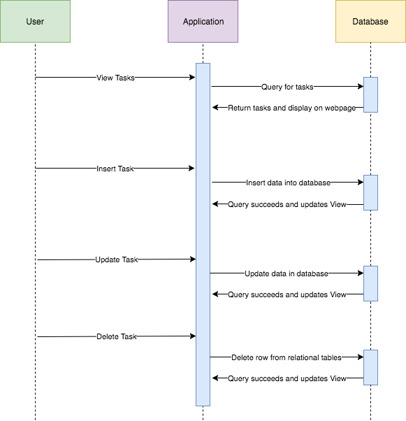

# ToDo_Project

#### Table of Contents
1. [Description](#description)
2. [Deployment Guide](#deployment-guide)
3. [Functional Requirements](#functional-requirements)
4. [Non-functional Requirements](#non-functional-requirements)
5. [System Architecture Diagram](#system-architecture-diagram)
6. [Data Flow Diagram](#data-flow-diagram)
7. [Use Cases](#use-cases)
8. [Sequence Diagram](#sequence-diagram)
9. [Database Diagram](#database-diagram)
10. [Class Diagram](#class-diagram)
11. [Test Cases](#test-cases)
12. [Work Breakdown](#work-breakdown)
13. [Demo of Program](#demo)

## Description
Light weight To Do Application to track tasks with four different statuses: pending, started, completed, and late.

## Deployment Guide
1. Go to http://www.wampserver.com/en/#download-wrapper and download the WAMP server using default settings. Ensure that all the server services are running. 
2. Download the ToDo_Project zip file and place the unzipped file into the following directory: C:/wamp64/www
3. Open a browser, preferably Chrome, and enter the following URL: localhost/ToDo_Project/home.php
4. The application will now be loaded. 

## Functional Requirements
1. 
2.
3.
4.
5.
6.

## Non-functional Requirements
1.
2.
3.
4.
5.
6.

## System Architecture Diagram

## Data Flow Diagram

## Use Cases
1.
2.
3.
4.
5.
6.

## Sequence Diagram

## Database Diagram

## Class Diagram

## Test Cases
1.
2.
3.
4.
5.
6.

## Work BreakDown

## Demo

