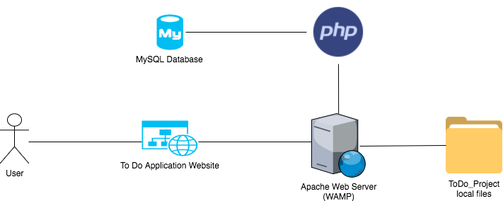
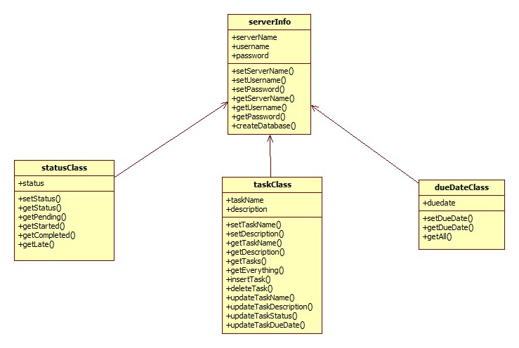

# ToDo_Project

#### Table of Contents
1. [Description](#description)
2. [Deployment Guide](#deployment-guide)
3. [Functional Requirements](#functional-requirements)
4. [Non-functional Requirements](#non-functional-requirements)
5. [System Architecture Diagram](#system-architecture-diagram)
6. [Data Flow Diagram](#data-flow-diagram)
7. [Use Cases](#use-cases)
8. [Sequence Diagram](#sequence-diagram)
9. [Database Diagram](#database-diagram)
10. [Class Diagram](#class-diagram)
11. [Test Cases](#test-cases)
12. [Work Breakdown](#work-breakdown)
13. [Demo of Program](#demo)

## Description
Light weight To Do Application to track tasks with four different statuses: pending, started, completed, and late.

## Deployment Guide
1. Go to http://www.wampserver.com/en/#download-wrapper and download the WAMP server using default settings. Ensure that all the server services are running. 
2. Download the ToDo_Project zip file and place the unzipped file into the following directory: C:/wamp64/www
3. Open a browser, preferably Chrome, and enter the following URL: localhost/ToDo_Project/home.php
4. The application will now be loaded. 

## Functional Requirements
1. Insert new tasks. 
2. Ability to update existing tasks.
3. Delete existing tasks.
4. View all tasks.
5. View tasks based on status.
6. View counts according to status.

## Non-functional Requirements
1. Efficient Queries. 
2. Optimal use of classes.
3. Fast performance.
4. Ease of use.
5. Integrity of data.
6. Reliable.

## System Architecture Diagram

## Data Flow Diagram

## Use Cases
1. Insert New Task - User has the ability to easily add new tasks.
2. Delete Tasks - User has the ability to delete any task they would like.
3. Update Task - User has ability to update any element of a certain task.
4. View All Tasks - User has ability to view all tasks currently stores within database.
5. View Task according to status - User has ability to view tasks according to one of the following: pending, started, completed, late. 
6. View counts of tasks - User has ability to view counts of all tasks according to their status. 

## Sequence Diagram

## Database Diagram

## Class Diagram

## Test Cases

### Insert New Task
#### Description
Test the function of adding a new task to the todo table. 

#### Steps
1. Open browser and enter following into url: localhost/ToDo_Project/home.php
2. Click on 'INSERT TASK' button.
3. Fill in all the fields with your new task.
4. Press 'INSERT'

#### Expected Result
A new task will be added to the database and will be reflected in the task table.

#### Actual Result

#### Pass/Fail

## Work BreakDown

### Update Task
#### Description
Update one or more elements of the task. 
#### Steps
1. Open browser and enter following into url: localhost/ToDo_Project/home.php
2. Click on 'UPDATE TASK' button.
3. Select the task ID of the task you would like to update from the drop down menu.
4. Enter your changes in the boxes. Leave the field blank if you do not want to update that variable.
5. Press 'UPDATE'

#### Expected Result
The field that was updated will be reflected within the database and in the table.

#### Actual Result

#### Pass/Fail

### Delete Task
#### Description
Test the function of deleting a task that has already been created. 
#### Steps
1. Open browser and enter following into url: localhost/ToDo_Project/home.php
2. Click on 'DELETE TASK' button.
3. Select the task ID of the task you would like to delete from the drop down menu.
4. Press 'DELETE'

#### Expected Result
Task will be deleted from database and will not show up in table. 

#### Actual Result

#### Pass/Fail

## Work BreakDown

### Filter for pending tasks
#### Description
View tasks with the status of pending.
#### Steps
1. Open browser and enter following into url: localhost/ToDo_Project/home.php
2. Click on 'Pending Tasks'

#### Expected Result
Table will appear with all pending tasks.
#### Actual Result

#### Pass/Fail

## Work BreakDown

### Filter for started tasks
#### Description
View tasks with the status of started.
#### Steps
1. Open browser and enter following into url: localhost/ToDo_Project/home.php
2. Click on 'Pending Tasks'

#### Expected Result
Table will appear with all started tasks.
#### Actual Result

#### Pass/Fail

## Work BreakDown

### Filter for completed tasks
#### Description
View tasks with the status of completed.
#### Steps
1. Open browser and enter following into url: localhost/ToDo_Project/home.php
2. Click on 'Pending Tasks'

#### Expected Result
Table will appear with all completed tasks.
#### Actual Result

#### Pass/Fail

## Work BreakDown

## Work BreakDown

### Install WAMP
Estimated No of hours: 1
Actual time spent: 1.5
Notes:
Issues:

### Implement database using php
Estimated No of hours: 2
Actual time spent: 2.5
Notes: Created a relation database. 
Issues: No issues. 

### Learn php syntax and implement OO programming
Estimated No of hours: 5
Actual time spent: 8
Notes: implemented all my classes using php.
Issues: It was difficult to understand how php was acting within an html file, especially when including other files which contained classes. 

### Create layout of all pages
Estimated No of hours: 5
Actual time spent: 8
Notes: Never really programmed in html and css. 
Issues: Everything I wanted to implement required me to look up how to do. Ran into issues of styling as there was a learning curve with these languages. 

### Documentation
Estimated No of hours: 6
Actual time spent: 12
Notes: Did not know many of the diagrams or differences between functional and non functional requirements, so there was quite a bit of time spent researching. 
Issues: Much of the information online ranged greatly and it was difficult to gain a good grasp of each concept. 

## Demo

